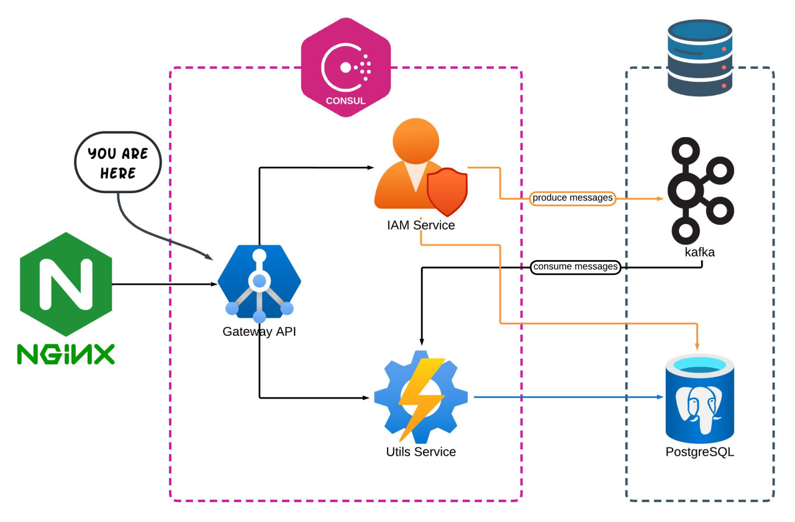

# Post-Hub • Gateway-Service

> Single entrypoint, smart routing, JWT validation, Swagger aggregation, Consul discovery

**Gateway-Service** is the single entry point to **Post-Hub**. It accepts external requests and routes them to the
proper microservice (**iam-service**, **utils-service**), validates JWT where configured, injects internal headers,
aggregates Swagger UI from all services, and registers with **Consul** for service discovery.

It is **1 of 3 core microservices**:

- **post-hub-gateway-service** (this repo)
- [post-hub-iam-service](https://github.com/densungkim/post-hub-iam-service)
- [post-hub-utils-service](https://github.com/densungkim/post-hub-utils-service)

---

## Project overview — Post-Hub

**Post-Hub** is a microservice-based social content platform where users can publish posts, comment, like, edit/delete
their content, and receive notifications about domain events.

**Components:**

* **iam-service** (this repo): Auth (registration, login, logout, refresh, password recovery), JWT, RBAC, Posts &
  Comments CRUD, domain events producer.
* **utils-service**: Kafka consumer for cross‑cutting tasks (e.g., notifications, async processing).
* **gateway-service**: Single entrypoint; routes traffic to services (deployed behind **Nginx**).
* **Consul**: service discovery/registration.

**Architecture diagram:**  


---

## Service scope — Gateway-Service

* **Routing** to `iam-service` and `utils-service` using **Spring Cloud Gateway** (WebFlux).
* **JWT validation** at the gateway via a custom `TokenValidationFilter` (applied to selected routes).
* **Internal-only routes** protected by `InnerAuthFilter` + internal header.
* **Swagger aggregation**: single Swagger UI showing doc groups for `gateway-service`, `iam-service`, and
  `utils-service`.
* **Service discovery** via **Consul** with health checks.
* **Forwarded headers** support for proxies (Nginx, etc.).

---

## Tech stack & versions

* **Java** 21
* **Spring Boot** 3.5.5
* **Spring Cloud (BOM)** 2025.0.0
* **Spring Cloud Gateway** (WebFlux)
* **OpenFeign** + `feign-jackson` 13.6
* **Springdoc OpenAPI** (WebFlux UI) 2.8.13
* **Spring Cloud Consul Discovery**
* **Spring Boot Actuator**
* **Apache Commons Lang** 3.18.0

All versions are aligned with this service’s `pom.xml`.

---

## API documentation

* **Unified Swagger UI** (via gateway): `http://localhost:8100/swagger-ui.html`  
  Groups:
    - `gateway-service` — the gateway’s own controllers
    - `iam-service` — proxied docs at `/{iam-service}/v3/api-docs`
    - `utils-service` — proxied docs at `/{utils-service}/v3/api-docs`

> Open endpoints (public by config): `/v3/api-docs`, `/auth/**`

---

## Main routes

| Path                      | Destination       | Access (Gateway)          | Notes                                               |
|---------------------------|-------------------|---------------------------|-----------------------------------------------------|
| `/auth/**`                | **iam-service**   | **Public**                | Auth endpoints (login, registration, refresh, etc.) |
| `/users/**`               | **iam-service**   | **TokenValidationFilter** | CRUD for users; JWT validated at gateway            |
| `/posts/**`               | **iam-service**   | — (service-level auth)    | CRUD for posts                                      |
| `/comments/**`            | **iam-service**   | — (service-level auth)    | CRUD for comments                                   |
| `/action-logs/**`         | **utils-service** | — (service-level auth)    | Utils-service public API                            |
| `/inner/iam-service/**`   | **iam-service**   | **InnerAuthFilter**       | Internal route; rewritten to `/inner/**`            |
| `/utils-service/inner/**` | **utils-service** | **InnerAuthFilter**       | Internal route; rewritten to `/inner/**`            |

> Discovery locator is enabled (`spring.cloud.gateway.discovery.locator.enabled=true`), so services are also resolvable
> by name via Consul.

---

## Build & run

### A) Local JVM (no containers for the app)

Prereqs: Java 21, Maven 3.9+, Docker

```bash
# run infrastructure (Postgres, Kafka, Consul)
docker compose up -d

# start the service
mvn spring-boot:run
```

### B) Local Docker (profile: [local](src/main/resources/application-local.properties))

This repo includes [iam-service.sh](docker/iam-service.sh) (entrypoint) and [Dockerfile](docker/Dockerfile).

```bash
# build jar file
mvn clean install -Dgroups='!integration'

# build image (context = repo root)
docker build -f docker/Dockerfile -t post-hub/iam-service .

# run container
docker run -d --name iam-service --network app-network -p 8189:8189 post-hub/iam-service
```

### C) Production — Docker (profile: [prod](src/main/resources/application-prod.properties))

For production you must provide environment variables:

- CONSUL_HOST

Minimal example:

```bash
docker run -d --restart unless-stopped \
  --name gateway-service \
  -p 8100:8100 \
  --network app-network \
  -e PROFILE=prod \
  -e CONSUL_HOST=consul \
  -e SERVER_IP=your.host.ip \
  post-hub/gateway-service:latest
```

---

## Ports (defaults)

* Gateway-Service: **8100**
* Consul: **8500**

---

## License

This project is licensed under the [MIT License](LICENSE).
